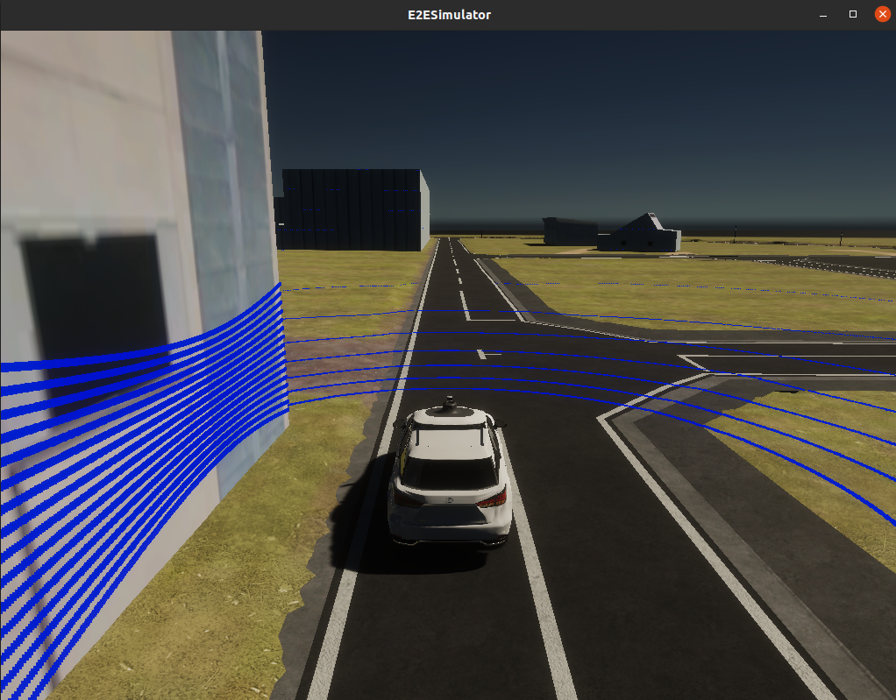
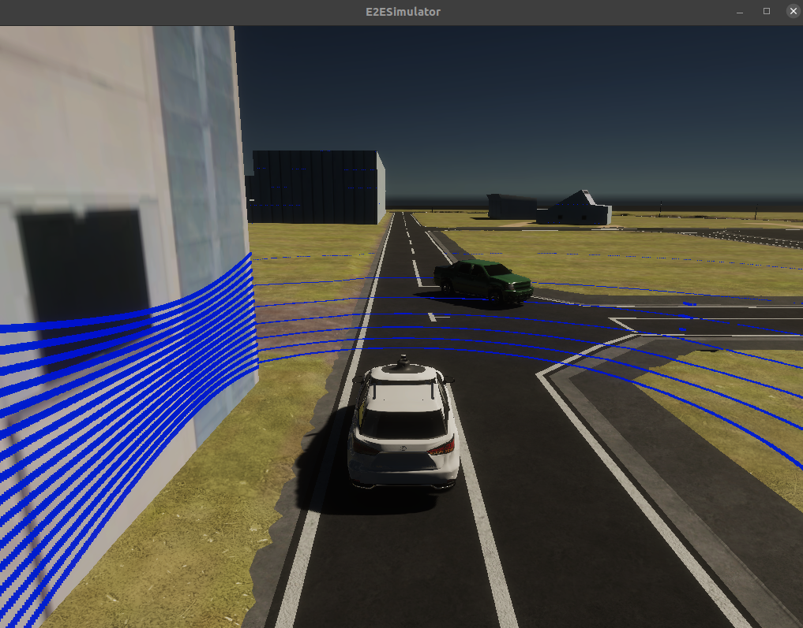
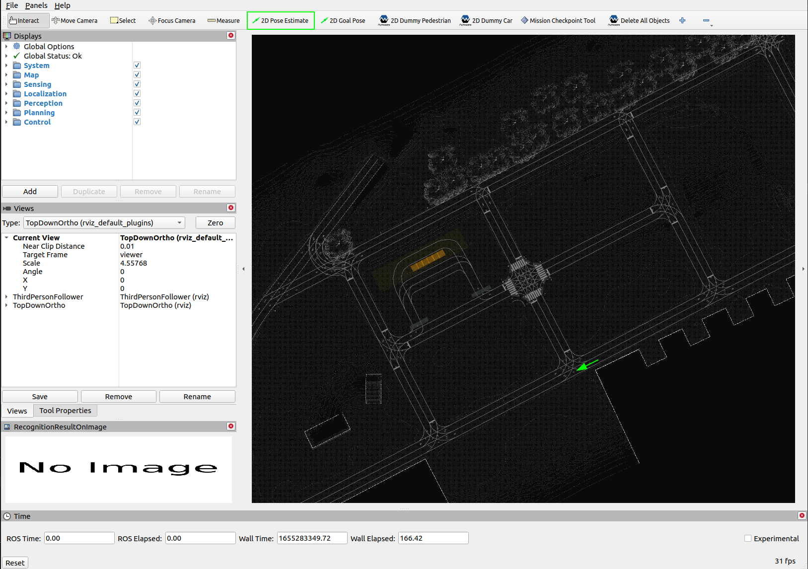

# TierIVSimulator Setup
This instruction presents how to run Tier IVs AWSIM with Autoware.

The official pre-relased simulator can be found on this [link](https://drive.google.com/file/d/1zdVYFqIy0LHfFOkTC36iFAgh7qXAy6Ih/view)

## Installation
The AWSIM with the Autoware should be run on Ubuntu 20.04 OS with ROS2 galactic configured.
Supported version of Autoware is tier4/autoware on branch feature/e2e_simulator_stable.

- Single-Line source installation

```sh
cd ~/autoware.universe/simulator/tierIVsim
chmod +x ./install-tierIVsim.sh
bash ./install-tierIVsim.sh
```


## NPC Control Tools 

This is a package responsible for handling the control over NPCs in the environment. It enables a user spawning/despawning NPCs, running scenarios corresponding to traffic situations in an urban environment, and many more. To set up the npc-control-tools package please follow the steps from the [Building](https://gitlab.com/robotec.ai/tieriv/npc-control-tools/-/blob/main/README.md#building-npc-control-client-ubuntu) section of the tool documentation.

## Running the solution

To run the AWSIM Simulator and Autoware it is advised to run the simulation first.

### AWSIM Simulator

To run the simulator open the terminal navigate to the simulation directory and run:

```sh
source /opt/ros/galactic/setup.bash
cd ~/TierIVSimulatorPackage/AWSIM
./AWSIM.x86_64
```
The properly working simulator should have the lidar rays visible and the data topics should appear when discovering using `ros2 topic list`.



#### Simulator Shourtcuts

It is possible to adjust/control the simulation through the shortcuts listed below:
- v - turn on/off lidar points visualization
- m - enter/exit manual operation mode (Ego listens to keyboard)
    - In manual mode:
        - d - drive
        - p - parking brake
        - r - reverse
        - arrows - acceleration and steering
        - lights:
            - 1 - left blinker
            - 2- right blinker
            - 3 - emergency lights
            - 4- turning the lights off

### NPC Control Tools (optional)

If you want to run the AWSIM Simulation in a urban-simulated environment please do the following steps:

open the terminal, change the directory to the npc-control-tools workspace and run the example
```sh
cd <NPC_WORKSPACE>/npc-control-tools
source install/setup.bash
ros2 run npc_control ex_kashiwanoha
```

The script execution will spawn some entities in the simulation screen as long as the script is alive. To despawn the entities please apply `Ctrl+C` combination to kill the process, however, sending the `Ctrl+C` multiple times can interrupt the cleanup routine and the entities will be left in the simulation. The only way to totally clear the scene is to restart the simulation and execute the example scenario once more.



 

### Autoware

To run the Autoware, please:

open the terminal and go to Autoware directory
```sh
cd <YOUR_WORKSPACE>/autoware
```

source the installation and run the solution
```sh
source ~/autoware/install/setup.bash
ros2 launch autoware_launch autoware.launch.xml map_path:=/home/cc/TierIVSimulatorPackage/KashiwanohaMaps vehicle_model:=sample_vehicle sensor_model:=sample_sensor_kit
```
the RViZ with the map should appear. The ego can localize itself at the beginning however the localization can be inaccurate. It is advised to place the `2D Pose Estimate` marker as shown on the image below.


 

to make the Autoware plan the route please place the `2D Goal Pose` marker somewhere within the lanelet2 road lanes. *NOTE: The plan can be not visible due to problem with plan visualization plugin which was omitted during the Autoware build process*

to make the Autoware execute plan please open new terminal and send the engage message:
```sh
cd <YOUR_WORKSPACE>/autoware
source install/setup.bash
ros2 topic pub /autoware/engage autoware_auto_vehicle_msgs/msg/Engage "engage: true"
```
From now on the Autoware will execute the path and operate the AWSIM Simulator.

- Terminal 1 - Launch Simulator

```sh
source ~/autoware/install/setup.bash
ros2 launch autoware_launch autoware.launch.xml map_path:=/home/cc/TierIVSimulatorPackage/KashiwanohaMaps vehicle_model:=sample_vehicle sensor_model:=sample_sensor_kit
```
- Terminal 2 - Launch Autoware

```sh
cd ~/autoware
source install/setup.bash
ros2 topic pub /autoware/engage autoware_auto_vehicle_msgs/msg/Engage "engage: true"
```